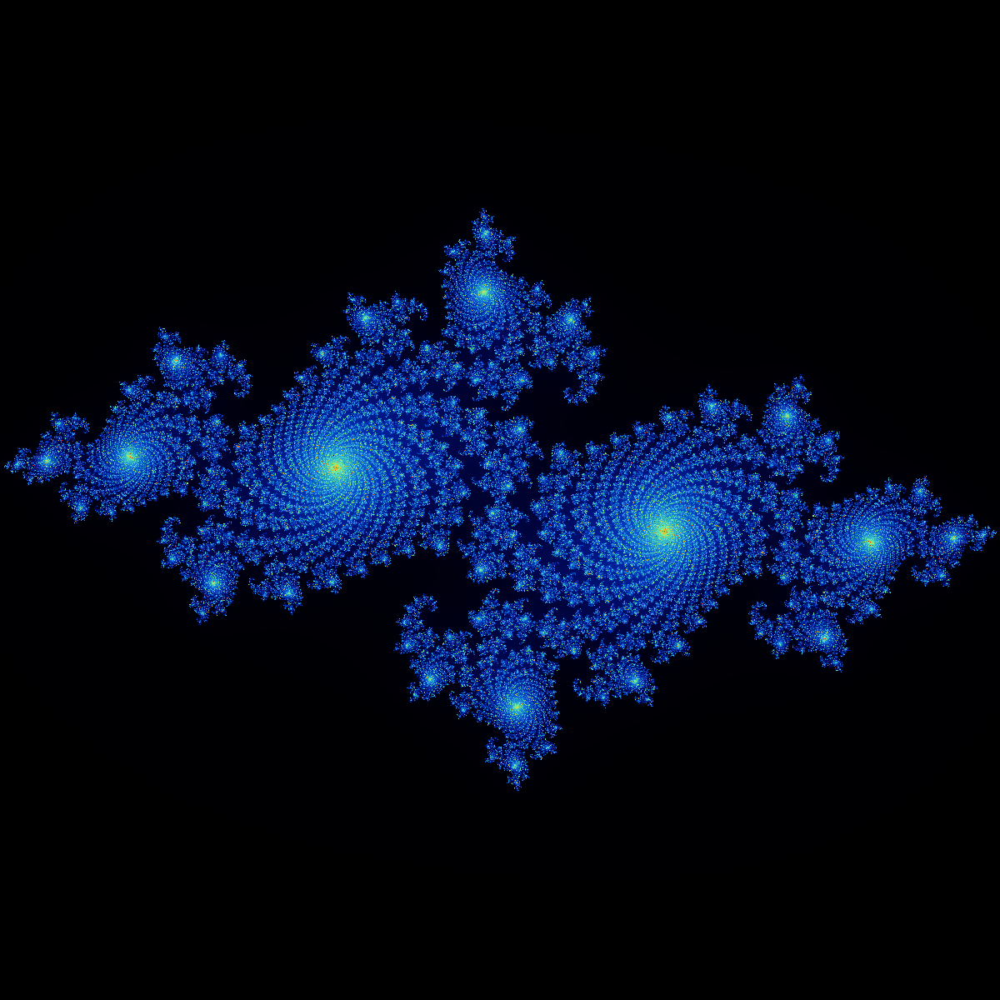
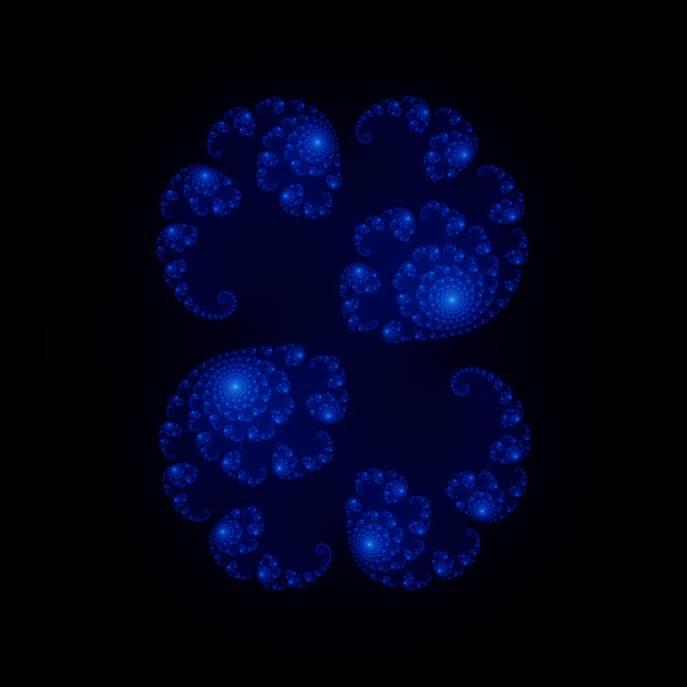

## Julia Sets with C++

Visualising Julia set fractals using FreeImage.

Requirements to compile are:
- CMake v3.22
- FreeImage
- C++ 17 standard compiler (g++ or Visual Studio)

### Julia Set Examples

